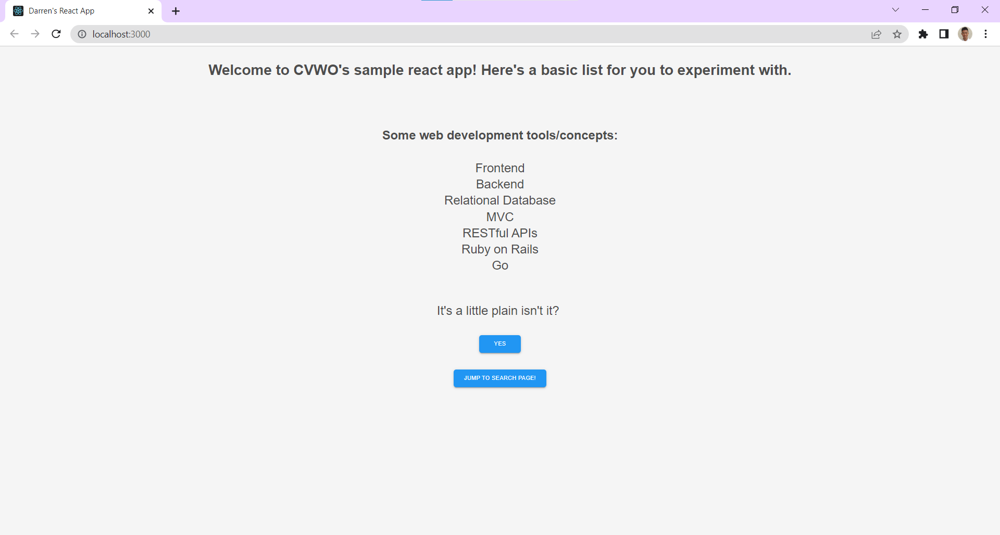
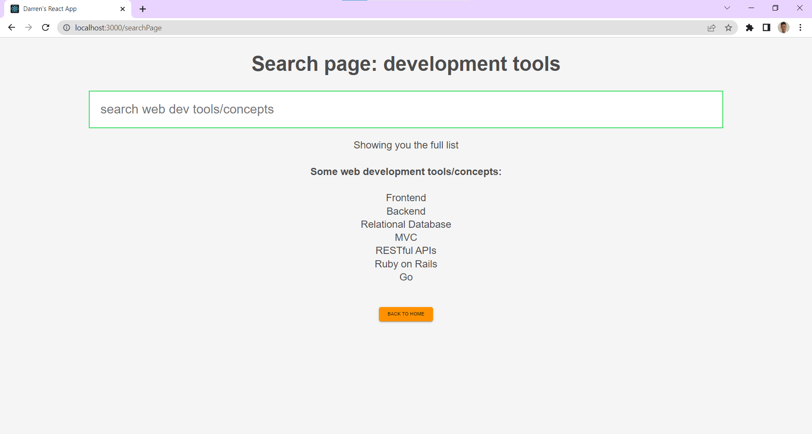
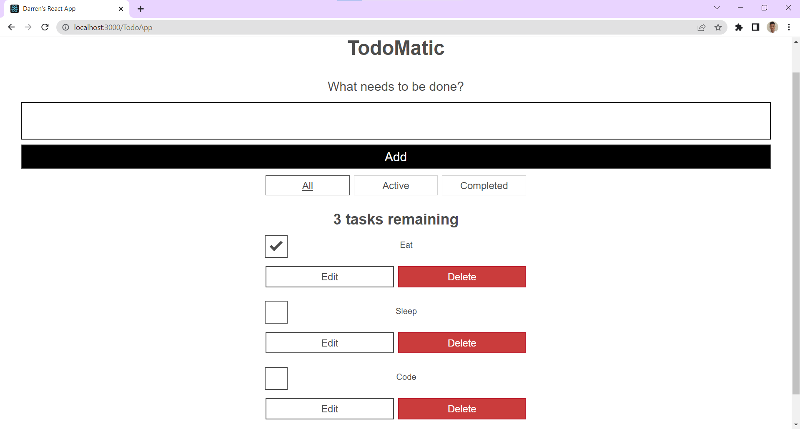

# CVWO Assignment Sample React App
**Modified extensively by me**

## Description
There are a few pages in this React app. At the home page, you will see a page like this.


From here you can navigate to the searchPage where you can type words into the search bar and the webpage will show you
a filtered list of the given items.


You could also navigate to the todoApp webpage as shown below, where you can add, remove, and complete items, and the 
webpage will respond accordingly.


## Getting Started
### Running the app
1. Open your terminal and navigate to the directory containing your cloned project.
2. Install dependencies for the project by using `yarn install` or `npm install`.
3. Run the app in development mode by using `yarn start` or `npm start` or `npm run parcel-start`.
4. Open [http://localhost:3000](http://localhost:3000) or [http://localhost:1234](http://localhost:1234) (for Parcel) 
to view it in the browser.

### Navigating the code
This is the main file structure
```
.
├── node_modules
├── public
├── src
├── README.md
├── tsconfig.json
├── package.json
├── .prettierrc.json
├── .eslintrc.json
├── yarn.lock
└── other admin files
```

Main directories/files to note:
* `src` usually includes all your source code. That is where most of your functional code will be.
* `README.md` is a form of documentation about the project. It is what you are reading right now.
* `package.json` contains important metadata, for example, the dependencies and available scripts in the project.

## Additional Notes

* This project uses [Typescript](https://www.typescriptlang.org/).
* The available scripts are in `package.json`.
  Here are some scripts that you are likely to use more often:
  * `yarn start` or `npm start` or `npm run parcel-start`
  * `yarn lint:fix` or `npm run lint:fix`
  * `yarn format:fix` or `npm run format:fix`

## Developer notes
I use the `.postcssrc` file to  configure PostCSS, which gives us access to the latest CSS features like CSS nesting.
CSS nesting is another way of writing CSS selectors, in a more readable manner (by enclosing a selector inside another selector).
[CSS Nesting](https://blog.logrocket.com/native-css-nesting/)

I use ESLint and Prettier, with the config files in `.eslintrc.json` and `.prettier.json`. They are used together with 
webstorm integration.

The `.cache` file is used by Parcel for faster build process.

### Using Webstorm debugger
[Reference link](https://www.jetbrains.com/help/webstorm/react.html#react_running_and_debugging_debug)
Excerpt from the above link:

> If your application is running on localhost, you can also start the debugger from the built-in Terminal or from the Run 
> tool window.

It is explained [here](https://www.jetbrains.com/help/webstorm/react.html#ws_react_debug_localhost) but the gist is that
after setting breakpoints, you can start the application using npm/yarn as per usual, then hold Ctrl+Shift and click 
the URL link. WebStorm starts a debugging session with an automatically generated Debug Application configuration.

For full explanation on the webstorm-React integration check [here](https://www.jetbrains.com/help/webstorm/react.html).

## Common errors encountered while coding
- Missing properties in [props validation](https://github.com/jsx-eslint/eslint-plugin-react/blob/master/docs/rules/prop-types.md):
You can fix this by providing the types statically using TypeScript using either `type` or `interface`. 
_Interface is extendable but type is simply an alias._ 


- Invalid configuration file `src\App.tsx`: JSON Error in `\sample-react-app\.prettierrc.json`. This occurs because 
you use the IDE to create the file, and it is not strictly UTF-8 characters. Use VS code to create the file instead.
[Link](https://stackoverflow.com/questions/70387394/prettier-invalid-configuration-file-even-though-the-file-is-straight-from-the-d)


- When writing functional components do not explicitly state the type to be `React.FC<{}>` because this would cause the props
type to be defined to be defaultProps. This prevents us from providing our own props. Either explicitly use `React.FunctionComponent<{ title: string }>`,
or leave the type annotation out. [Link](https://react-typescript-cheatsheet.netlify.app/docs/basic/getting-started/function_components/)

## Acknowledgements
This project was bootstrapped with [Create React App](https://github.com/facebook/create-react-app).
This project uses [MUI](https://mui.com/),
[TypewriterJS](https://github.com/tameemsafi/typewriterjs#readme),
[ESLint](https://eslint.org/), [Prettier](https://prettier.io/).
